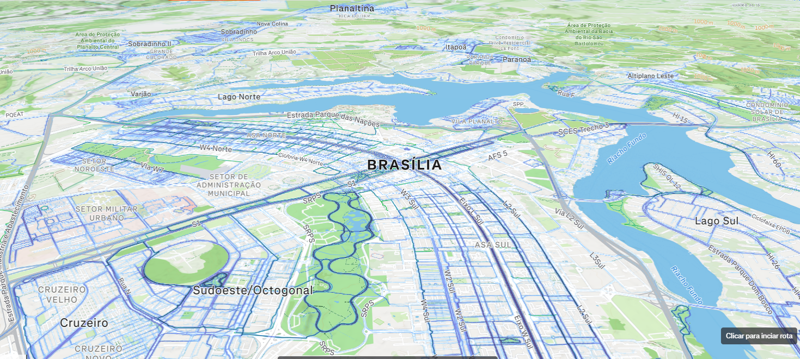

# Visão geral do módulo {#sec-m2}



::: {.modulo-meta}
**Carga horária:** 6 horas (3h síncronas + 3h assíncronas)\
**Datas:** a definir\
**Pacotes:** `sf`, `terra`, `tidyterra`, `geobr`, `censobr`, `sidrar`, `osmdata`, `elevatr`, `leaflet`, `mapview`, `ggspatial`\
**Estudo de caso:** faixa de influência populacional da BR-116 na Serra do Mar (PR/SC)
:::

## O que você vai conseguir fazer no fim do módulo

- Ler, escrever e converter dados espaciais nos formatos que circulam no Ministério:
  `.shp`, `.gpkg`, `.geojson`, `.csv` com coordenadas e GeoTIFF.
- Reconhecer e trocar sistemas de coordenadas sem corromper a geometria, e saber **quando**
  reprojetar é obrigatório.
- Fazer as operações que hoje você faz por menu no QGIS/ArcGIS (*buffer*, interseção,
  recorte, junção espacial, cálculo de área e distância) em código reexecutável.
- Ler e processar rasters (altimetria, uso do solo) e extrair valores por geometria.
- Baixar bases públicas brasileiras direto do R: malhas do IBGE, Censo, SIDRA e
  OpenStreetMap.
- Produzir um mapa estático de qualidade de publicação e um mapa interativo para conferência.

## Roteiro

### Aula síncrona (3h)

| Bloco | Conteúdo | Capítulo |
|:--|:--|:--|
| 1 | O objeto `sf`: estrutura, leitura, escrita, tipos de geometria | @sec-m2-sf |
| 2 | Sistemas de coordenadas e projeções: SIRGAS 2000, UTM, quando reprojetar | @sec-m2-crs |
| 3 | Rasters com `terra`: leitura, recorte, álgebra, extração por geometria | @sec-m2-raster |
| 4 | Geovisualização: `geom_sf`, `leaflet`, `mapview`, mapas de conferência | @sec-m2-mapas |

### Conteúdo assíncrono (3h)

| Bloco | Conteúdo | Capítulo |
|:--|:--|:--|
| 5 | Operações geométricas e junções espaciais | @sec-m2-geometrias |
| 6 | Bases públicas brasileiras: `geobr`, `censobr`, `sidrar`, `osmdata` | @sec-m2-bases |
| 7 | Estudo de caso: população na faixa de influência da BR-116 | @sec-m2-estudo-de-caso |
| 8 | Exercícios | @sec-m2-exercicios |

## Pacotes do módulo

```{r}
#| eval: false
pacotes <- c("sf", "terra", "tidyterra", "geobr", "censobr", "sidrar",
             "osmdata", "osmextract", "elevatr", "leaflet", "mapview", "ggspatial", "units")

faltando <- setdiff(pacotes, rownames(installed.packages()))
if (length(faltando) > 0) install.packages(faltando)
```

::: {.callout-important}
## No Windows, instale o Rtools antes

`sf` e `terra` dependem das bibliotecas GDAL, PROJ e GEOS, que são compiladas na instalação.
Sem o **Rtools** (ver @sec-m1-ambiente) a instalação falha com erro de compilação. Confirme
depois com:

```{r}
#| eval: false
library(sf);    sf::sf_extSoftVersion()
library(terra); terra::gdal()
```
:::

## Sobre os *downloads* deste módulo

Os blocos deste módulo baixam dados públicos na primeira execução e **guardam em disco**, em
`dados/brutos/`. Nas execuções seguintes, leem do cache. O render fica rápido e funciona sem
internet. O padrão usado em todo o material é este:

```{r}
#| eval: false
arquivo <- "dados/brutos/municipios_pr.gpkg"

if (!file.exists(arquivo)) {
  muni <- geobr::read_municipality(code_muni = "PR", year = 2022)
  sf::st_write(muni, arquivo, quiet = TRUE)
}
muni <- sf::st_read(arquivo, quiet = TRUE)
```

Vale adotar esse hábito nos seus próprios scripts: além de acelerar, ele garante que a
análise continue reproduzindo o **mesmo** resultado quando a base de origem for atualizada.
